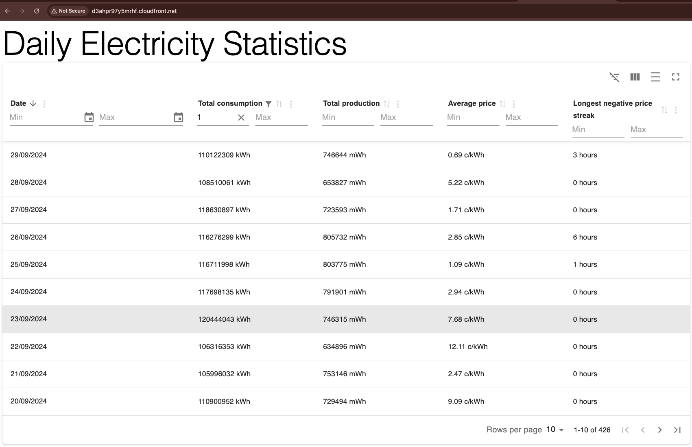

# Dev Academy Spring 2025 Exercise Frontend

## Project Description

This project is a single-page application that displays daily electricity statistics in a table format. The application features server-side filtering, pagination, and sorting, with local caching provided by TanStack Query.

## Online preview

> [!WARNING]
> Note: The application currently runs over HTTP, and HTTPS is not supported. Some browsers may automatically redirect to HTTPS, so ensure you manually change it back to HTTP if necessary.

👉 http://d3ahpr97y5mrhf.cloudfront.net/

## Run Locally

### Requirements

You need to have Node.js 18+ or 20+ installed and be able to run npm commands. Some dependencies may require a higher Node.js version—please upgrade if your package manager warns about compatibility issues.

### Clone repository

Open terminal in your preferred location.

```bash
git clone https://github.com/Apluri/dev-academy-spring-2025-exercise-frontend.git
cd dev-academy-spring-2025-exercise-frontend
```

### Install dependencies

```bash
npm install
```

## How to run application

### Against local server

Follow [backend instructions](https://github.com/Apluri/dev-academy-spring-2025-exercise-backend) to ensure the API is running.

Start the frontend development server:

```bash
npm run dev
```

Frontend runs at http://localhost:5173/

### Against production server

Runs the frontend locally with production settings, using the hosted backend.

```bash
npm run prod
```

Frontend runs on http://localhost:5173/

## How to run tests & code analyzers

### Unit tests

```bash
npm run test
```

### E2E tests

#### Testing against locally running backend

1. Start dockerized backend
2. Start frontend with `npm run dev` command
3. Run E2E tests with `npm run cypress:run`

#### Testing against prod backend running in the cloud

1. Start frontend with `npm run prod` command
2. Run E2E tests with `npm run cypress:run`

### Run linter

```bash
npm run lint
```

## How to build the production package

### Build package

```bash
npm run build
```

### Preview built package

Runs at http://localhost:4173/

```bash
npm run preview
```

## Features

### Host info

The frontend is a static React application hosted in Amazon S3, with Amazon CloudFront as a CDN.

### Tech / Frameworks used

- React + Vite + TypeScript
- Vitest (Unit testing)
- Cypress (E2E testing)
- Material UI (UI components)
- Material React Table (Table UI)
- TanStack Query (Auto refetching & caching)
- Zod (Schema validation)
- Github Actions (Automated tests & lint check)

### Application features

The application consists of a single-page interface featuring a data table that displays daily electricity statistics.

Table Displays:

- Date
- Total electricity consumption
- Total electricity production
- Average electricity price
- Longest negative price streak (in hours)

Table Functionality:

- Server-side processing:

  - Filtering
  - Pagination
    -Sorting

- Client-side caching:

  - Managed with TanStack Query, using query keys

  ### Application Preview

  
